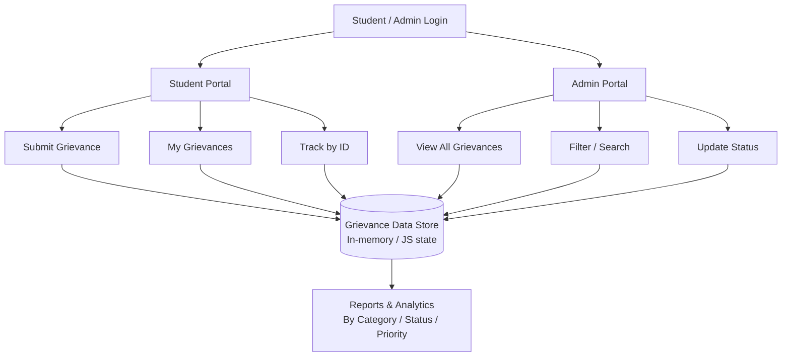

# SOT Grievance Management System

A student grievance management platform that lets students submit, track, and manage complaints digitally, while giving administrators a centralized dashboard to review, update, and resolve grievances in real time.

The system provides role-based portals (Student & Admin), unique grievance tracking IDs, category/priority classification, and a live analytics dashboard for institutional insights.


---

## 🚀 Project Overview

Traditional grievance redressal in colleges often relies on physical complaint boxes, emails, or informal reporting — leading to lost records, no tracking, and delayed resolution.

This project aims to build a digital grievance platform that can:

- Let students submit grievances with category, priority, and description
- Generate a unique, trackable grievance ID for every submission
- Allow students to track grievance status without logging in
- Give admins a centralized dashboard to view, filter, and resolve grievances
- Support status workflows (Pending → Under Review → In Progress → Resolved/Rejected)
- Provide analytics on grievance volume by category, status, and priority

---

## 🎯 Objectives

1. Provide a simple student login and grievance submission flow.
2. Auto-generate unique grievance tracking IDs.
3. Allow public grievance tracking via ID lookup.
4. Classify grievances by category (Academic, Examination, Infrastructure, Financial, etc.) and priority.
5. Maintain a full status lifecycle for each grievance.
6. Provide an admin portal to review, filter, and update grievances.
7. Allow admins to attach resolution notes visible to students.
8. Generate real-time reports on grievance distribution and trends.

---

## 🏗️ System Overview



> Renders automatically on GitHub — no image export needed. If you prefer a static image, generate one at [mermaid.live](https://mermaid.live) and drop it in `/screenshots`.

---

## 🔄 Grievance Status Lifecycle

| Status | Meaning |
|---|---|
| **Pending** | Grievance submitted, not yet reviewed |
| **Under Review** | Admin has opened and is assessing it |
| **In Progress** | Action is actively being taken |
| **Resolved** | Issue closed with a resolution note |
| **Rejected** | Grievance closed without action, with a reason |

---

## 🛠️ Tech Stack

**Frontend**
- HTML5 — Application structure
- CSS3 — Custom dark-themed UI, responsive layout, animations
- JavaScript (Vanilla ES6+) — App logic, state management, dynamic rendering

**Core Features Implemented**
- Role-based access (Student / Admin)
- Dynamic grievance submission form with category & priority selection
- Unique auto-generated grievance IDs (e.g. `SOT-2024-001`)
- Public grievance tracking (no login required)
- Status lifecycle management (Pending, Under Review, In Progress, Resolved, Rejected)
- Admin search & filter by ID, name, title, and status
- Real-time analytics dashboard (category, status, priority breakdowns)
- Toast notifications for user actions

**Planned / In Progress**
- Backend API (Node.js / Python) for persistent data storage
- Database integration (MySQL / MongoDB) to replace in-memory state
- Secure authentication (JWT-based login)
- Email notifications on status updates

---

## 📁 Project Structure

```
Grievance-Management-System/
├── Backend/            # API layer (planned/in-progress)
├── frontend/           # HTML, CSS, JS application
├── screenshots/        # UI screenshots for README/demo
└── README.md
```

---

## ⚙️ Getting Started

**Prerequisites**
- A modern browser (Chrome, Edge, Firefox)
- (Optional) [Node.js](https://nodejs.org/) if you're running the backend locally

**Run locally**

```bash
# Clone the repo
git clone https://github.com/anishjammigumpula903/Grievance-Management-System.git
cd Grievance-Management-System/frontend

# Open directly in browser
open index.html
# or serve it locally
npx serve .
```

Since the current version runs entirely on frontend state, no build step or backend setup is required to try it out.

---

## 📸 Screenshots

> Add screenshots from the `/screenshots` folder here, e.g.:
> ``

---

## 🗺️ Roadmap

- [ ] Node.js/Express (or FastAPI) backend with REST API
- [ ] MongoDB/MySQL persistence layer
- [ ] JWT-based authentication for students and admins
- [ ] Email notifications on status change
- [ ] Exportable analytics reports (PDF/CSV)
- [ ] Deployment (Render/Vercel + hosted DB)

---

## 🤝 Contributing

Contributions, issues, and feature requests are welcome. Feel free to open an issue or submit a pull request.

## 📌 Note

This version runs entirely on the frontend using in-memory JavaScript state — grievance data resets on page reload. Backend integration for persistent storage is planned as a next step.

## 📄 License

This project is licensed under the MIT License.
